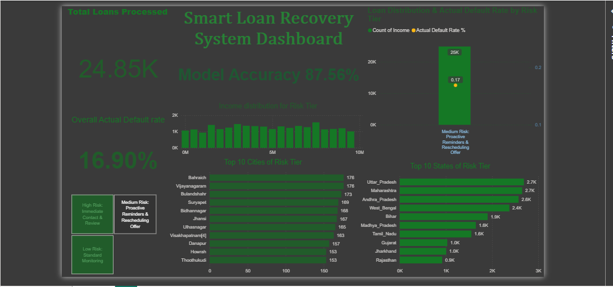

# 💡 Smart Loan Recovery System

## 🔍 Project Overview
Traditional loan recovery is often reactive and inefficient. This project introduces a smart, ML-powered approach to identify high-risk borrowers and recommend tailored recovery strategies — saving time and improving loan recovery efficiency.

## 🎯 Objectives
- Predict the likelihood of a loan default using classification models.
- Categorize customers into risk tiers: High, Medium, and Low.
- Recommend targeted actions for recovery based on the risk level.

## 🧾 Dataset Summary
- **Total Records:** 24,850
- **Features:** Income, Age, Experience, Marital Status, House & Car Ownership, Profession, City, State, etc.
- **Target Variable:** `Risk_Flag` (1 = Defaulted, 0 = Paid)
- **Source:** Column structure (Income, Age, Experience, City, State, Risk_Flag) matches the commonly-used *"Loan Prediction Based on Customer Behavior"* dataset. The exact original source wasn't recorded in the notebook at the time — if you have the original Kaggle link, worth adding it here for full reproducibility.

## 🛠️ Tools & Technologies
- **Python (Google Colab)** – Data analysis, modeling
- **XGBoost** – Model training & evaluation
- **scikit-learn** – Pipeline, preprocessing (ColumnTransformer, StandardScaler, OneHotEncoder), metrics
- **Power BI** – Dashboard visualization
- **Pandas, Matplotlib, Seaborn** – EDA & preprocessing

## 🧼 Data Cleaning
- Verified no missing or invalid values.
- Converted categorical variables for model readiness.
- Standardized and encoded features for ML training (StandardScaler + OneHotEncoder via sklearn Pipeline).

## 🤖 Model Summary
- **Algorithm Used:** XGBoost Classifier (`XGBClassifier`)
- **Model Accuracy:** **87.56%**
- **Evaluation Metrics:** Accuracy, Precision, Recall, F1 Score, ROC AUC, Confusion Matrix

## 📊 Dashboard Highlights
- **Model Accuracy:** 87.56%
- **Actual Default Rate:** 16.9%
- **Top Risk Cities/States Visualized**
- **Income Distribution by Risk Tier**
- **Tier-based Recovery Recommendations:**
  - High Risk → Immediate Contact & Review
  - Medium Risk → Proactive Reminders & Rescheduling
  - Low Risk → Standard Monitoring

## 📌 Key Insights
- Majority of defaults occur within the Medium-Risk tier.
- Income doesn't always correlate directly with risk.
- Certain states (e.g., Uttar Pradesh, Maharashtra) show higher risk concentrations.

## ✅ Recommendations
- Focus recovery efforts on medium-risk tier using automation and personalized communication.
- Regular monitoring of low-risk customers to maintain repayment behavior.
- Deeper investigation of high-risk clusters in specific cities/states.

## 🧠 Author
**Khoshaba Odeesho** – Data Analyst
📍 Melbourne
🔗 [LinkedIn](http://linkedin.com/in/khoshaba-odeesho-17b5b92aa)
🐙 [GitHub](https://github.com/Assyrian91)
